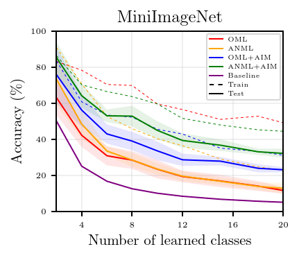
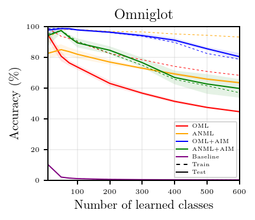

# Few-Shot and Continual Learning with Attentive Independent Mechanisms

This repository is the official implementation of continual learning part in *Few-Shot and Continual Learning with Attentive Independent Mechanisms*. 

## Requirements

To install requirements:

```setup
pip install -r requirements.txt
```

All experiments can be run on a single NVIDIA GTX1080Ti GPU.


The code was tested with python3.6 the following software versions:

| Software | Version | 
|----------|---------| 
| cuDNN    | 7.6.5   |
| Pytorch  | 1.6.0   |
| CUDA     | 10.2    |


## Training

### Meta-train


| argument      | parameters | 
| ------------- |-------------| 
| dataset       | `omniglot` or `cifar100` or `imagenet`(for MiniImagenet) |
| treatment     | `OML+AIM` or `ANML+AIM` |


To meta-train the models used in the paper, run this command: (example for training a OML+AIM on Omniglot)

```
python3 mrcl_classification.py --treatment OML+AIM --dataset omniglot --rln 12
```

### Meta-test

To perform evaluating method in the paper, run this command: (example for quantizing a ANML+AIM on MiniImageNet)

```
python3 evaluate_classification.py --treatment ANML+AIM --model imagenet_ANML+AIM_10000.net --dataset imagenet
```

## Results

Our model achieves the following performance on :

<div>
  </div>


## Contributing

The code is released for academic research use only. For commercial use, please contact [anonymous@anon.com](anonymous@anon.com).

