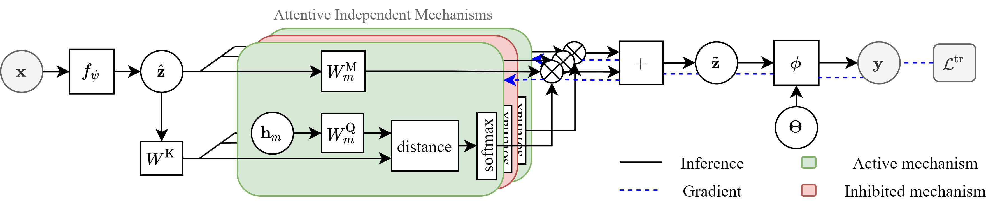

# Few-Shot Learning with Attentive Independent Mechanisms

This repository is the official implementation of [Few-Shot Learning with Attentive Independent Mechanisms](https://arxiv.org/abs/2107.14053). 



## Requirements

To install requirements:

```setup
pip install -r requirements.txt
```

All experiments can be run on a single NVIDIA GTX1080Ti GPU.


The code was tested with python3.6 the following software versions:

| Software        | version |
| ------------- |-------------|
| cuDNN         | 7.6.5 |
| Pytorch      | 1.5.0  |
| CUDA | 10.2    |


## Training

### Pretrain features


| argument        | parameters |
| ------------- |-------------|
| model         | `ConvNet_4_64` or `WRN_28_10` |
| dataset      | `miniImageNet` or `Cifar` |
| config | `config/` + `Conv_CIFAR_1shot.yaml` or `Conv_CIFAR_5shot.yaml` or `Conv_miniImageNet_1shot.yaml` or `Conv_miniImageNet_5shot.yaml` or `WRN_CIFAR_1shot.yaml` or `WRN_CIFAR_5shot.yaml` or `WRN_miniImageNet_1shot.yaml` or `WRN_miniImageNet_5shot.yaml`   |


To pre-train the feature extractor(s) used in the paper, run this command: (example for training a WRN-28-10 on miniImageNet)

```
python3 train_feat.py --outDir pretrained_model/miniImageNet_WRN_60Epoch_base --cuda --dataset miniImageNet --model WRN_28_10  --nbEpoch 60 --config config/WRN_miniImageNet_1shot.yaml
```


### Meta-learning

To train the meta-learner used for few-shot classification in the paper, run this command: (example for training a WRN-28-10 on miniImageNet)

```
 python3 main.py --config config/WRN_miniImageNet_1shot.yaml --seed 100 --gpu 0 --useAIM
```


## Evaluation

To evaluate the trained WRN-28-10 on miniImageNet, run:

```eval
python3 main.py --config config/WRN_miniImageNet_1shot.yaml --seed 100 --gpu 0 --useAIM --ckpt path/to/pretrained_model
```


## Pre-trained Models

During the review process, models for pre-trained feature extractor are stored in `pretrained_model/DATASET_MODEL_numEpoch_xx.xxx` and models for meta-learner are stored in `pretrained_meta_model/netAIM_MODEL_DATASET_numshot.pth`

Due to upload file size limitation, we only provide pre-trained model for Conv-4-64 trained using CIFAR-FS.

## Results

Our model achieves the following performance on :

### Image Classification on MiniImageNet 5-way

| Model         | [1-shot Accuracy](https://paperswithcode.com/sota/few-shot-image-classification-on-mini-2)  | [5-shot Accuracy](https://paperswithcode.com/sota/few-shot-image-classification-on-mini-3) |
| ------------------ |---------------- | -------------- |
| Conv-4-64   |     61.90±0.57%        |      74.55±0.38%       |
| WRN-28-10   |     71.22±0.57%        |      82.25±0.34%       |

### Image Classification on CIFAR-FS 5-way

| Model         | [1-shot Accuracy](https://paperswithcode.com/sota/few-shot-image-classification-on-cifar-fs-5)  | [5-shot Accuracy](https://paperswithcode.com/sota/few-shot-image-classification-on-cifar-fs-5-1) |
| ------------------ |---------------- | -------------- |
| Conv-4-64   |     71.09±0.62%        |      80.48±0.40%       |
| WRN-28-10   |     80.20±0.55%        |      87.34±0.36%       |


## Contributing

The code is released for academic research use only. For commercial use, please contact [eugene@ieee.org](eugene@ieee.org).

