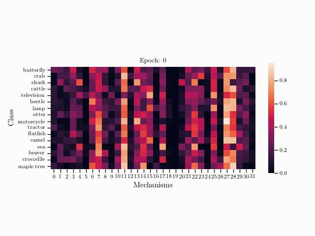

# Few-Shot and Continual Learning with Attentive Independent Mechanisms

This repository is the official implementation of [Few-Shot and Continual Learning with Attentive Independent Mechanisms](https://arxiv.org/abs/2107.14053) that has been accepted to International Conference of Computer Vision (ICCV) 2021. 


<!-- 
### Directory layout
    .
    ¢u€ Fewshot
    ¢x¢u€ xxx
    ¢x¢|€ README.md
    ¢u€ Continual
    ¢x¢u€ xxx
    ¢x¢|€ README.md
    ¢|€ README.md -->

## Few-shot learning

`Fewshot/`: Implementation of AIM for few-shot learning.




## Continual learning

`Continual/`: Implementation of AIM for continual learning.

## Contributing

If you find this work useful, consider citing our work using the following bibTex:
```
@article{lee2021few,
  title={Few-Shot and Continual Learning with Attentive Independent Mechanisms},
  author={Lee, Eugene and Huang, Cheng-Han and Lee, Chen-Yi},
  journal={arXiv preprint arXiv:2107.14053},
  year={2021}
}
```
